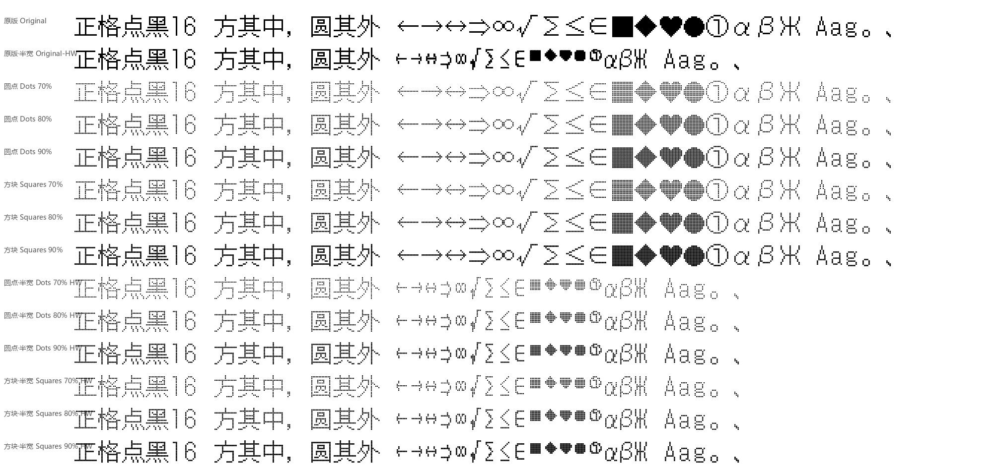
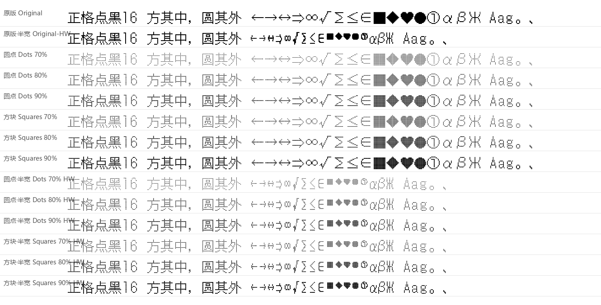
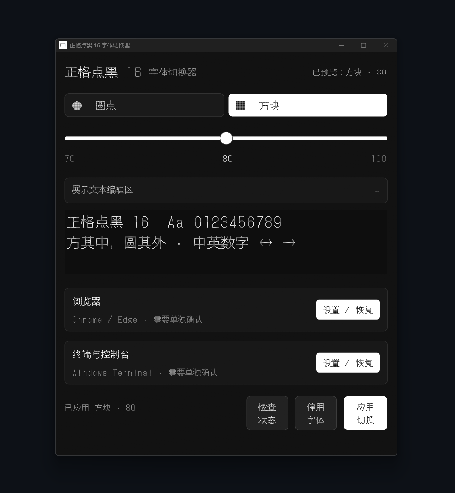
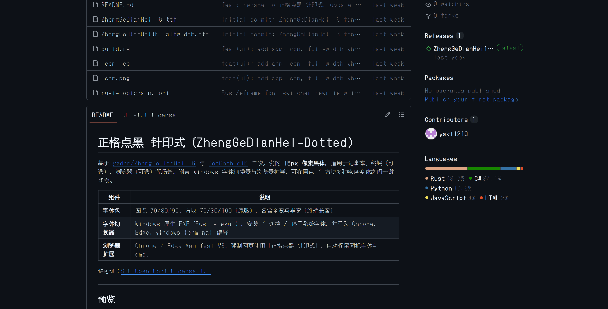

# 正格点黑 针印式（ZhengGeDianHei-Dotted）

基于 [yzdnn/ZhengGeDianHei-16](https://github.com/yzdnn/ZhengGeDianHei-16) 与 [DotGothic16](https://github.com/fontworks-fonts/DotGothic16/) 二次开发的 **16px 像素黑体**，适用于记事本、终端（可选）、浏览器（可选）等场景。附带 Windows 字体切换器与浏览器扩展，可在圆点 / 方块多种密度变体之间一键切换。

| 组件 | 说明 |
| --- | --- |
| **字体包** | 圆点 70/80/90、方块 70/80/100（原版），各含全宽与半宽（终端兼容） |
| **字体切换器** | Windows 原生 EXE（Rust + egui），安装 / 切换 / 停用系统字体，并写入 Chrome、Edge、Windows Terminal 偏好 |
| **浏览器扩展** | Chrome / Edge Manifest V3，强制网页使用「正格点黑 针印式」，自动保留图标字体与 emoji |

许可证：[SIL Open Font License 1.1](./LICENSE)

---

## 预览

### 48px 预览



### 30px 预览



### 应用截图



---

## 快速开始（推荐：Release 包）

1. 打开 [Releases](https://github.com/yaki1210/ZhengGeDianHei-Dotted/releases)，下载最新的 `ZhengGeDianHei16-FontSwitcher-windows.zip`
2. 解压后目录结构大致为：

   ```text
   正格点黑.exe
   fonts\          ← 全部 TTF 变体（必须与 EXE 同级）
   extension\      ← 可选：浏览器扩展
   README.md
   ```

3. **先为所有用户安装任意一个字体文件**（重要，见下方「首次安装」）
4. 再运行 `正格点黑.exe`，选择变体后点 **应用切换**

> 不要只拷贝 EXE：缺少同级 `fonts\` 目录时，切换器无法加载变体。

---

## 首次安装（必须）

应用内的「应用切换」会把字体装到**当前用户**字体目录。为了让 Windows / 部分软件稳定识别字体族名，建议第一次这样操作：

1. 进入 `fonts\` 文件夹
2. 任选一个 `.ttf`（例如 `ZhengGeDianHei16-Dots80.ttf`）
3. **右键 → 为所有用户安装**（需要管理员权限）
4. 安装完成后再启动字体切换器，用界面切换其它密度 / 形状

之后日常切换只需在切换器里点 **应用切换** 即可。

---

## 字体切换器使用

### 变体说明

| 形状 | 密度 | 文件名示例 | 观感 |
| --- | --- | --- | --- |
| 圆点 | 70 / 80 / 90 | `ZhengGeDianHei16-Dots80.ttf` | 点阵镂空，数字越大点越「实」 |
| 方块 | 70 / 80 / 100 | `…Squares70` / `…Original` | 方块像素；100 为实心原版 |
| 半宽 `-HW` | 同上 | `…-HW.ttf` | 符号半宽，适合终端，避免与下一字重叠 |

### 主界面

1. 选择 **圆点 / 方块** 与密度滑条
2. 预览区可展开编辑示例文字（仅预览，不落盘）
3. 底部按钮：
   - **检查状态**：查看当前是否已安装
   - **停用字体**：移除本工具管理的安装文件
   - **应用切换**：安装当前选中变体（当前用户）

### 浏览器集成（Chrome / Edge）

1. **先完全退出**对应浏览器（托盘图标也要退出）
2. 在切换器中展开「浏览器 → 设置 / 恢复」
3. 点 **应用 Chrome** 或 **应用 Edge**
4. 重新打开浏览器验证

也可在切换器中 **恢复** 浏览器字体设置（会写回备份）。

#### 浏览器注意事项

- **建议把浏览器默认字号调大**（例如 18–24）。本字体为 16px 设计，网页默认 16 时偏紧、细节难辨。
- **Chrome**：应用设置后一般可正常使用。
- **Edge 已知问题**：
  - 通过切换器写入的字体偏好**有时无法稳定保存**
  - 可能被系统 / Edge 再次覆盖为 **Noto Sans SC** 等字体
  - 若 Edge 无效，优先用 **Chrome**，或改用本仓库的 **浏览器扩展** 强制页面字体

### Windows Terminal

1. 展开「终端与控制台 → 设置 / 恢复」
2. 需要窄字符不重叠时，勾选 **窄终端兼容模式（半宽符号）**，再 **应用切换** 安装对应 `-HW` 字体
3. 点 **应用终端字体**（写入 `settings.json`，首次会备份）

---

## 浏览器扩展（可选）

路径：`extension/`

适合不想改浏览器全局设置、或 Edge 设置被覆盖时使用。

### 安装

1. Chrome 打开 `chrome://extensions`（Edge：`edge://extensions`）
2. 开启右上角 **开发者模式**
3. **加载已解压的扩展程序** → 选择 `extension` 文件夹
4. （可选）固定扩展图标

### 使用

- 默认开启：网页正文字体强制为「正格点黑 针印式」
- 自动保留 Material Icons / Font Awesome / iconfont 等图标字体
- emoji 走系统回退，不受影响
- 点击扩展图标可开关
- **改完后刷新页面** 完全生效

> 扩展只负责「网页用哪套已安装字体」。请先完成上文的系统字体安装，否则会回退到无衬线字体。



---

## 从源码构建切换器

环境：Windows + [Rust](https://rustup.rs/)（MSVC toolchain）

```powershell
cargo build --release --target x86_64-pc-windows-msvc
# 产物：
#   target\x86_64-pc-windows-msvc\release\zhengge-font-switcher.exe
```

打包给他人使用时，请把 EXE 与 `dist\fonts\` 放在一起（EXE 旁需有 `fonts\`）：

```powershell
New-Item -ItemType Directory -Force dist\release | Out-Null
Copy-Item target\x86_64-pc-windows-msvc\release\zhengge-font-switcher.exe `
  dist\release\正格点黑.exe
Copy-Item dist\fonts dist\release\fonts -Recurse -Force
```

GitHub Actions 工作流：`.github/workflows/build-rust.yml`（push / 手动触发）。

### 字体变体生成（可选）

`tools/` 下有 Python 脚本（`build_variants.py`、`fix_halfwidth_symbols.py` 等），用于从基底 TTF 生成圆点 / 方块 / 半宽变体。日常使用 **不需要** 跑这些脚本，直接用 `dist/fonts` 即可。

---

## 仓库目录说明

### 建议纳入 Git / 发布源码

| 路径 | 用途 |
| --- | --- |
| `src/`、`Cargo.toml`、`build.rs`、`rust-toolchain.toml` | 切换器源码 |
| `dist/fonts/` | 发布用字体变体（与 EXE 配套） |
| `dist/icon.ico`、`icon.ico`、`icon.png` | 应用与扩展图标 |
| `extension/` | 浏览器扩展 |
| `preview/*.png` | 效果预览图 |
| `tools/*.py`、`tools/FontSwitcher.cs` | 字体生成与旧版参考实现 |
| `ZhengGeDianHei-16.ttf`、`ZhengGeDianHei16-Halfwidth.ttf` | 基底字体 |
| `README.md`、`LICENSE`、`.github/` | 文档与 CI |

### 关键资源依赖说明

下表说明这些资源为什么需要纳入 Git，以及移除后会造成什么影响：

| 资源 | 用途 | 能否从 Git 移除 |
| --- | --- | --- |
| `ZhengGeDianHei-16.ttf` | 基底全宽字体，所有变体的生成源 | 否（移除后无法重建字体） |
| `ZhengGeDianHei16-Halfwidth.ttf` | 半宽符号字体源，由 `tools/fix_halfwidth_symbols.py` 生成 | 否（`-HW` 变体依赖它） |
| `icon.ico` | Windows 可执行文件图标，`build.rs` 编译时使用 | 否（移除后 EXE 无图标或编译失败） |
| `icon.png` | 应用窗口图标，`src/main.rs` 通过 `include_bytes!` 嵌入 | 否（移除后 Rust 编译报错） |
| `tools/*.py` | 字体变体生成、预览图生成、校验脚本 | 否（移除后无法从源码生成字体/预览） |
| `tools/FontSwitcher.cs` | 旧版 C# 字体切换器参考实现 | 可保留作为历史参考 |
| `dist/fonts/*.ttf` | 发布用字体变体，与 EXE 配套分发 | 否（Release 包核心内容） |
| `dist/icon.ico` | 发布包图标副本 | 可保留，与根目录 `icon.ico` 保持一致 |
| `extension/icons/*.png` | 浏览器扩展图标 | 否（扩展必需） |
| `preview/*.png` | README 效果预览图 | 否（文档展示用） |

### 应忽略、不要提交

| 路径 | 原因 |
| --- | --- |
| `target/` | Rust 编译缓存 |
| `dist/*.exe`、`dist/release/`、`zhengge-font-switcher-windows/` | 构建产物，走 **GitHub Releases** |
| `preview/fonts/` | 与 `dist/fonts` 重复的大体积副本 |
| `tools/original_backup/` | 基底字体备份副本 |
| `.trae/`、`.vscode/`、`.idea/` | 编辑器本地文件 |
| `Snipaste_*.png`、`__pycache__/`、`plan.md` | 截图、缓存、内部草稿 |

完整规则见 [`.gitignore`](./.gitignore)。

---

## 常见问题

**Q: 只运行 EXE，预览是空的或提示找不到字体？**  
A: 确认 `fonts\` 与 EXE 在同一目录，且内含 `ZhengGeDianHei16-*.ttf`。

**Q: 浏览器里完全看不出像素风？**  
A: 先确认系统已安装字体；网页字号过小时细节糊成一团，请调大浏览器默认字体；也可用扩展强制页面字体。

**Q: Edge 设完又变回 Noto Sans SC？**  
A: 已知兼容问题。请改用 Chrome，或安装本仓库扩展。

**Q: 终端里符号和汉字叠在一起？**  
A: 勾选「窄终端兼容模式」，重新 **应用切换** 后再 **应用终端字体**。

**Q: 本字体与点点像素体有什么区别？**  
A: [点点像素体](https://github.com/wixette/dotted-chinese-fonts) 为 12px 宋体（衬线），本字体为 16px 黑体（无衬线），像素密度更高、字形更清晰，更符合我的审美。

---

## 致谢

- 基底字体来自 [yzdnn/ZhengGeDianHei-16](https://github.com/yzdnn/ZhengGeDianHei-16)（SIL OFL 1.1），在原版「ドットゴシック16」基础上增补了简繁汉字
- 日文字形来源 [DotGothic16](https://github.com/fontworks-fonts/DotGothic16/)（Fontworks / SIL OFL 1.1）
- 切换器 UI： [egui](https://github.com/emilk/egui) / eframe
